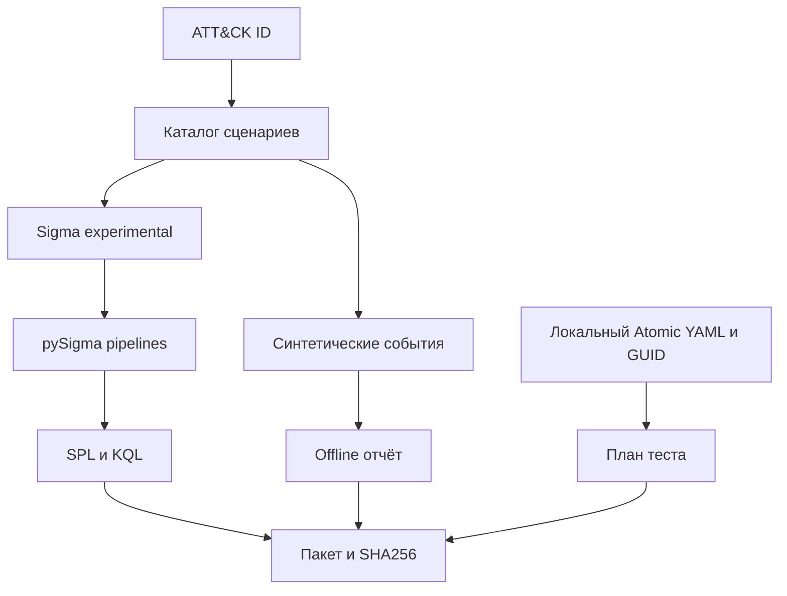

# Архитектура

## Компоненты

`cli.py` разбирает аргументы и возвращает коды. `core.py` разрешает сценарий, создаёт Sigma, вызывает backends, проверяет Atomic YAML и формирует пакет. `data/scenarios.json` содержит собственный минимальный каталог. Внешнего HTTP API, службы и базы данных нет.

## Поток данных

Сценарий задаёт Image suffix и факультативные CommandLine substrings. Один сценарий соответствует одному правилу и стабильному UUID v5; версия семантики входит в UUID namespace URL. Этот URL используется как имя пространства, а не как сетевой сервис.

Каждый backend получает новую SigmaCollection, поскольку pipeline изменяет представление правила. Splunk и Defender имеют независимые модели данных. Пользователь сверяет реальное source/sourcetype/index либо DeviceProcessEvents до теста.

Offline validator воспроизводит узкий предикат сценария, а не исполняет Sigma, SPL или KQL. Это явно отражено в поле scope. Синтетический pass не доказывает backend-семантику, доставку события или реальное обнаружение.

## Границы доверия

Atomic YAML приходит с локального диска и остаётся недоверенным содержимым. Команды из него выводятся как данные, subprocess отсутствует. GUID и technique ID валидируются перед интерполяцией в PowerShell-пример. Зависимости и input arguments требуют ручного review; автоматически не устанавливаются.

Output создаётся эксклюзивно. Manifest покрывает все файлы кроме самого manifest. Если запись оборвалась, каталог может быть неполным: checksum review обнаружит это; автоматическое удаление пользовательских файлов не выполняется. Родительский каталог выбирает пользователь; защита от злонамеренного локального пользователя и race/symlink атак вне scope.
